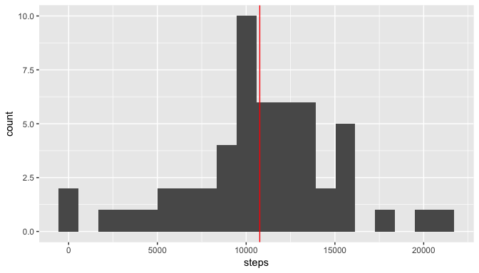
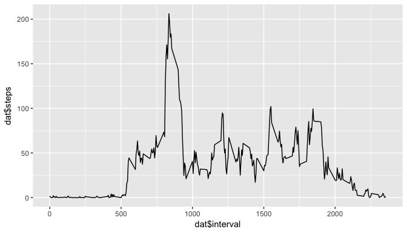
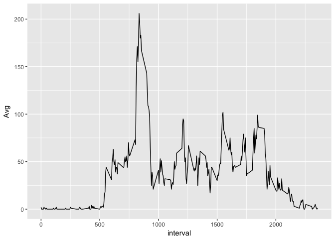
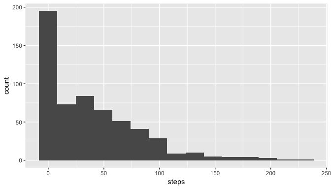
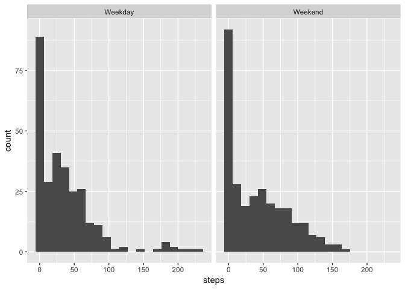
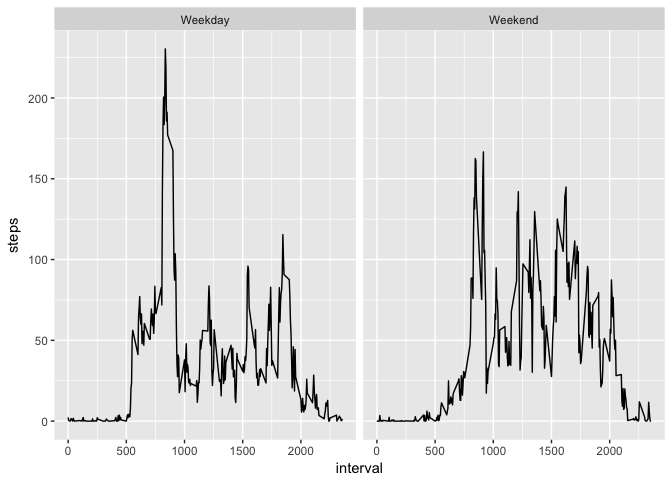

# Reproducible Research Course Project 1


####Matthew Jorden


First step is loading the libraries needed for the analysis. I am loading lubridate to manipulate dates, ggplot2 for nicer visualizations and data.table so I can use data tables for faster analysis.


```r
library(lubridate)
library(ggplot2)
library(plyr)
library(data.table, warn.conflicts = FALSE, quietly = TRUE)
```

## Loading and preprocessing the data

The first step is loading the data. The Coursers instructors provided the activity comma separated value file, which must be read into R. I also convert the date string to dates using lubridate, convert the data frame to a data table, and load ggplot2 for later use:


```r
dat <- read.csv("activity.csv")
dat$date <- ymd(dat$date)
dat <- as.data.table(dat)
str(dat)
```

```
## Classes 'data.table' and 'data.frame':	17568 obs. of  3 variables:
##  $ steps   : int  NA NA NA NA NA NA NA NA NA NA ...
##  $ date    : Date, format: "2012-10-01" "2012-10-01" ...
##  $ interval: int  0 5 10 15 20 25 30 35 40 45 ...
##  - attr(*, ".internal.selfref")=<externalptr>
```

##What is the mean total number of steps taken per day?

###1. Calculate total number of steps per day

I'm going to use aggregate to create new data set with total (sum) number of steps taken per day, across all intervals.


```r
aggdat <- aggregate(dat$steps ~ dat$date, FUN = sum)
aggdat$date <- aggdat$`dat$date`
aggdat$steps <- aggdat$`dat$steps`
#aggdat <- dat[, lapply(.SD,sum), by = date]
head(aggdat)
```

```
##     dat$date dat$steps       date steps
## 1 2012-10-02       126 2012-10-02   126
## 2 2012-10-03     11352 2012-10-03 11352
## 3 2012-10-04     12116 2012-10-04 12116
## 4 2012-10-05     13294 2012-10-05 13294
## 5 2012-10-06     15420 2012-10-06 15420
## 6 2012-10-07     11015 2012-10-07 11015
```

###2. Make a histogram of the total number of steps taken per day

Now that we have aggregated the data using lapply, we have a data set with summed number of steps by day. You can see in the code that I have a commented-out call to qplot. I initially used qplot but finally decided to use the gpplot instead, but I wanted to keep my qplot call just in case.

Lets plot using ggplot2 to see the general patterns of the data:


```r
p <- ggplot(na.omit(aggdat), aes(x = steps)) + geom_histogram(bins = 20)
p <- p + geom_vline(aes(xintercept = mean(na.omit(steps))), color = "red")
print(p)
```

<!-- -->

```r
#qplot(na.omit(aggdat$steps), bins = 10)
```

The red line displayed on the histogram is the mean of the steps data.

###3. Calculate the mean and median number of steps take per day

I will just omit na values, and have R return the mean and median of the aggregated data set.


```r
mean(na.omit(aggdat$steps))
```

```
## [1] 10766.19
```

```r
median(na.omit(aggdat$steps))
```

```
## [1] 10765
```

So we can see that the mean number of steps per day is 10,766.19 while the median number of steps is 10,765.

## What is the average daily activity pattern?

###1. Make a time series plot of the average number of steps taken by interval

First, I will create a second aggregated data set, arranging by interval instead of date.


```r
aggdat2 <- aggregate(dat$steps ~ dat$interval, FUN = mean)
aggdat2$interval <- aggdat2$`dat$interval`
aggdat2$steps <- aggdat2$`dat$steps`
```

Now lets plot the data to see how steps vary through the day.


```r
p <- ggplot(data = aggdat2, aes(x = `dat$interval`,y = `dat$steps`)) + geom_line()
print(p)
```

<!-- -->

```r
#qplot(aggdat2$interval, aggdat2$steps)
```

###2. Which 5 minute interval has the highest mean number of steps

We can immediately see that morning is the highest period of activity for the steps data. Lets see which 5 minute interval has the highest number of steps, on average across all days in the data set.


```r
aggdat2$interval[which.max(aggdat2$steps)]
```

```
## [1] 835
```

According to the call to which.max, 8:35 to 8:40 AM is the 5 minute interval with the highest number of steps across all days.

##Imputing Data

###1. Calculate number of NA values

Lets take a look to see how many NA values we have in our "steps" data.


```r
nrow(dat[is.na(dat$steps),])
```

```
## [1] 2304
```

###2. Fill in missing values

Ok, now lets fill in the missing values. I'm going to use ddplyr from the plyr library to fill in the values based on the average for the given interval across all days in the data set.


```r
impTable <- ddply(na.omit(dat), ~interval, summarize, Avg = mean(steps))
impTable$Avg <- round(impTable$Avg, digits = 0)
head(impTable)
```

```
##   interval Avg
## 1        0   2
## 2        5   0
## 3       10   0
## 4       15   0
## 5       20   0
## 6       25   2
```

You'll notice I also rounded the average numbers to whole numbers.

Now I want to take a look at the average number of steps per interval. I want to verify that the pattern looks plausibly similar to the data set I plotted earlier.


```r
p <- ggplot(data = impTable, aes(x = interval, y = Avg)) + geom_line()
print(p)
```

<!-- -->

```r
#qplot(impTable$interval, impTable$Avg)
```

Now that I'm satisfied that the averaged data represents the daily patterns, I will create a subset of na data and replace the NA values with the average for that interval.

###3. Create a new dataset with NAs filled

I merge the NA dataset with the interval average table using merge, and then re-order the columns to match the original data set.


```r
nadat <- dat[is.na(dat$steps),]
impDat <- merge(nadat, impTable, by = c("interval"))
impDat$steps <- impDat$Avg
impDat <- impDat[, c(2, 3, 1)]
head(impDat)
```

```
##    steps       date interval
## 1:     2 2012-10-01        0
## 2:     2 2012-10-08        0
## 3:     2 2012-11-01        0
## 4:     2 2012-11-04        0
## 5:     2 2012-11-09        0
## 6:     2 2012-11-10        0
```

Now I want to verify that the data tables are structure similarly:


```r
head(dat)
```

```
##    steps       date interval
## 1:    NA 2012-10-01        0
## 2:    NA 2012-10-01        5
## 3:    NA 2012-10-01       10
## 4:    NA 2012-10-01       15
## 5:    NA 2012-10-01       20
## 6:    NA 2012-10-01       25
```

And finally a few QA checks. I rbind the substituted NA values with the original data set (with NAs removed).

Next, I check to make sure the merged data dimensions match the original data set dimensions, and verify that the new data set is clear of all NAs.


```r
impDat <- rbind(na.omit(dat), impDat)
dim(impDat)
```

```
## [1] 17568     3
```

```r
dim(dat)
```

```
## [1] 17568     3
```

```r
sum(is.na(impDat))
```

```
## [1] 0
```

```r
sum(is.na(dat))
```

```
## [1] 2304
```


###4. Histogram of Post-NA Imputed Data

I'm getting a bit ahead of myself here, but I choose this point to add in the factor data requested in the next section. When coding this up, I found it made sense to add the factors as I am creatng the new, imputed data set of mean steps per interval.


```r
impDat$day <- weekdays(impDat$date)
impDat$Cat <- ifelse(impDat$day %in% c("Saturday", "Sunday"), "Weekend", "Weekday")

aggimpDat <- ddply(impDat, .(interval, Cat), summarize, steps = mean(steps))

#aggimpDat <- impDat[, lapply(.SD,sum), by = interval]
p <- ggplot(aggimpDat, aes(x = steps)) + geom_histogram(bins =15)
print(p)
```

<!-- -->

##Are there differences between weekends and weekdays?

###1. Create factor to differentiate

I created the factor in the previous code block, so here I will facet the histogram based on weekend or weekday status. You can see that, generally, mid day intervals have higher counts on weekends than weekdays.


```r
p <- ggplot(data = aggimpDat, aes(x = steps)) + geom_histogram(bins=20) + facet_grid(. ~ Cat)
print(p)
```

<!-- -->

###2. Make a time series plot showing weekend vs weekday interval trends for mean steps per interval

Here I am just making a simple ggplot2 faceted plot, with interval v mean steps for that interval.


```r
p <- ggplot(data = aggimpDat, aes(x = interval, y = steps)) + geom_line()
p <- p + facet_grid(. ~ Cat)
print(p)
```

<!-- -->

The data shows that activity is more evenly distributed (and later) on weekends. Whereas the clear peak of activity is around 8:30 AM on weekdays, the max activity is obviously later on weekends. Lets check that peak activity levels for both data sets.


```r
weekend <- aggimpDat[aggimpDat$Cat == "Weekend",]
weekend$interval[which.max(weekend$steps)]
```

```
## [1] 915
```

```r
weekday <- aggimpDat[aggimpDat$Cat == "Weekday",]
weekday$interval[which.max(weekday$steps)]
```

```
## [1] 835
```


